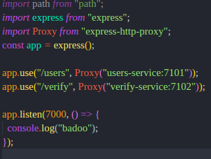

# Dockerized-Microservices-App
A very simple application to showcase my knowledge of microservices architecture and docker.

*Note: The app does not really have a usecase I was more focused on the architecural pattern and also the implementation
I will definitely still create a side-project that will have a usecase and beautiful architectural pattern*

### Highlights:
- I made my own API GATEWAY ( a shared layer to serve client requirements with microservices architecture).
- I used a docker compose file to ensure communication between my services(Gave me a tough time. Had a major error you can read about it in my Error Highlight).
- I used Babel so I could write next-gen Javascript thereby making my code more readable.


### Technologies

Node.js --- Docker----MySQL---ExpressJs---Babel---PayStack-Api---Express-http-proxy

## Project Implementation 

**File Structure Picture** 


I had two services (Implemented Independently of each other )
- User Service
  - A service to create new users and get all users
  - Built as a docker image so I could use it in my docker-compose file 
  - Used mysql docker image to store user information.

- Verify Service
  - A Verification Service to verify Nigerian Account Number and Resolve Card Bin (utillizes **Paystack Api**)
  - Built as a docker image so I could use it in my docker-compose file 


**API GATEWAY**
I really enjoyed Implementing this:

Overview:
I implemented an API gateway that is the single entry point for all clients. The API gateway handles requests and simply routes request to the appropriate service. It handles other requests by fanning out to multiple services.


Points from the Image above:
- My gateway is running on port 7000.. My User service on port 7101 ...My Verify service on port 7102 
- I checked the client request and determined the service to routee to.
- I used a proxy to route the client request to the requested service 
*Note: This is a basic api gateway implementation*

#### Docker--- Docker-Compose
- I wrote a Dockerfile for each of my two services so I could use them as images
- I wrote a Dockerfile for my api-gateway for I could use it as an image
- I wrote a Docker-Compose file to create a network between my services
- I used mysql image to create a database network for my users service 


#### EndPoints
**User Services**

Service that stores the user

**GET Request--- get all users**
```
GET /users
```

**POST Request - creates a new user**
``` 
POST /users


{"name":"rest user"}
``` 

**Verify Service**

Service that verifies Nigerian Account Numbers and Resolve Card Bin utilizing  **PayStack Api** 

**GET Request ---verifies an account number with the bank code**
```
GET /verify/acc_no?account_no="ACCOUNT_NUMBER"&bank_code="BANK_CODE"
```

**GET Request --- Resolve Card BIN**
```
GET /verify/card_details/"FIRST_SIX_DIGITS_OF_PAN_CARD"
```


## Error Highlight 
**Experimental section**
**I want to start adding this to my readme to describe the biggest error I faced during the project**

**Error Faced**: API Gateway not routing requests to any of the services 
##### error image


**State of  API GATEWAY Code  Before Fixing the Error**:
<br/>


**How Long it took to fix**: Well A little Embarrassing to write but it took me like 1hr, before I could debug the error. Stack Overflow was my Saviour 

**Found a Similar question on StackOverflow and the StackOverFlow Comment that saved me is below**:
###### Stack Overflow Answer
<br/>


**State of API GATEWAY Code After Fixing the Error**:
<br/>


**End of Error Highlight**


## Test RUN
**USING POSTMAN TO TEST THE PROJECT**

##### Starting up docker-compose:
<br/>


#### Test
<br/>


